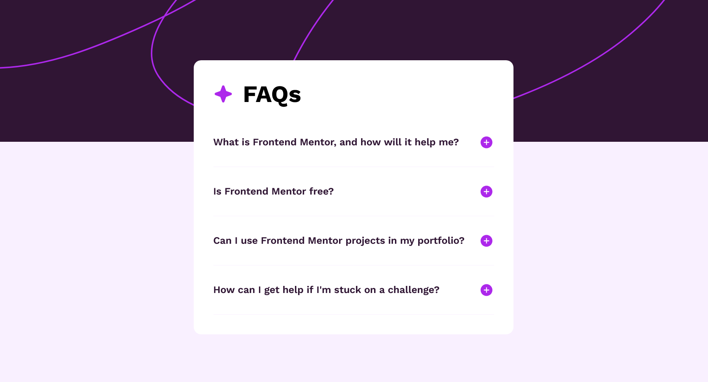

# Frontend Mentor - FAQ accordion solution

This is a solution to the [FAQ accordion challenge on Frontend Mentor](https://www.frontendmentor.io/challenges/faq-accordion-wyfFdeBwBz). Frontend Mentor challenges help you improve your coding skills by building realistic projects.

## Table of contents

- [Overview](#overview)
  - [The challenge](#the-challenge)
  - [Screenshot](#screenshot)
  - [Links](#links)
- [My process](#my-process)
  - [Built with](#built-with)
- [Author](#author)

## Overview

The project is a simple FAQs accordion, witch shows and hide the answers of the respective questions on the click of the plus(to show) or the minus(to hide) button;

### The challenge

Users should be able to:

- Hide/Show the answer to a question when the question is clicked
- Navigate the questions and hide/show answers using keyboard navigation alone
- View the optimal layout for the interface depending on their device's screen size
- See hover and focus states for all interactive elements on the page

### Screenshot

### Links

- Solution URL: [Solution URL]()
- Live Site URL: [Live Site URL]()

## My process

The HTML was made using the semantic structure, following the project structure, the CSS was made following the HTML document, from the main component for the components within it, finishing with the active states from the elements. The JavaScript was made in the most simple way, for the simplicity of the project, using the onclick event and the code for changing the style in Js for both hide and show the answers, for both the buttons and the paragraphs.

### Built with

- Semantic HTML5 markup
- CSS custom properties
- Flexbox

## Author

- Frontend Mentor - [@maria202costa](https://www.frontendmentor.io/profile/maria202costa)
